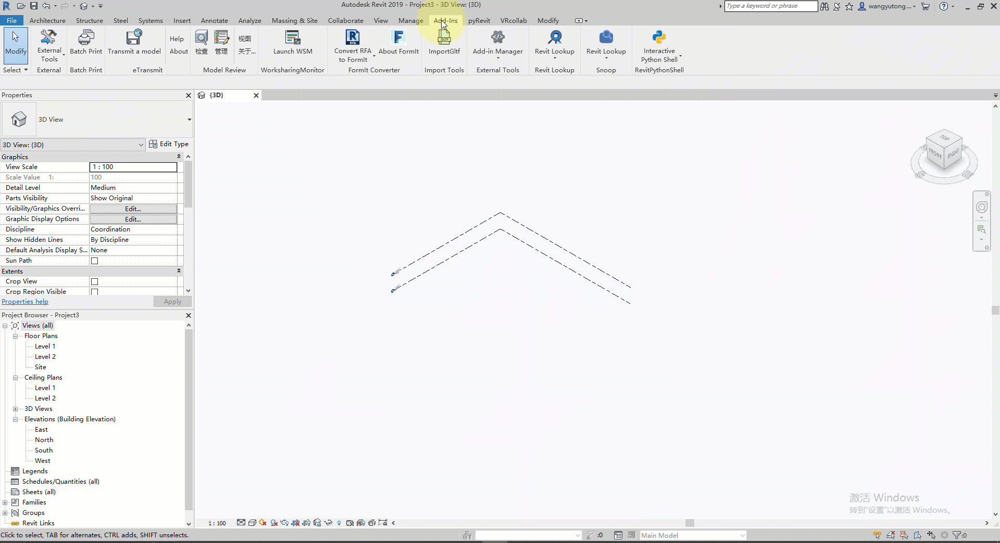

# gltf2Revit
This is a Revit addin to import gltf files into Revit by `DirectShape`.

## Dependencies

- SharpGLTF

## TODO list
- [x] import geometry
- [ ] material?
- [ ] properties?
- [ ] support more revit versions